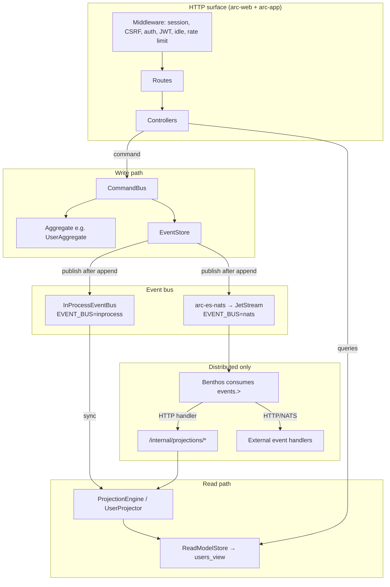

# Architecture

**Last updated:** 2026-07-27

## Overview

Arc is an **event-sourced workspace**. HTTP handlers dispatch **commands**; **aggregates** validate transitions and emit **events**; an **event store** appends them; an **event bus** notifies subscribers; **projections** build **read models** used by HTML and API. The primary user surface remains Actix + Tera SSR.



## Design principles

| Principle | Practice in Arc |
|-----------|-----------------|
| Events are source of truth | Append-only log; projections are derived |
| Commands produce events | All user mutations go through `CommandBus` |
| Reads are optimized views | Controllers read `users_view` (and similar), not rehydrate aggregates for every page |
| Core stays headless | `arc-core` has no Actix dependency |
| Pluggable storage | `EventStore` / `ReadModelStore` traits; SQLite or Postgres drivers |
| Writer ends at publish | Distributed consumers are outside the writer process |
| Benthos never owns DB writes | Projection SQL runs only in Arc-owned code paths |

## Crate responsibilities

| Crate | Role |
|-------|------|
| **arc-core** | `Event`, `Aggregate`, `Command`/`CommandBus`, `EventBus` traits, `Projector`/`ProjectionEngine`, `ReadModelStore`, audit/access/session/snapshot/integrity primitives |
| **arc-es-sqlite** | SQLite implementations of event store, read model, snapshots, JWT session revocation store |
| **arc-es-postgres** | Postgres event/read-model/snapshot stores (self-initializing schema) |
| **arc-es-nats** | JetStream `EventBus` publish path; stream / DLQ provisioning |
| **arc-web** | Actix bootstrap, middleware, helpers (config, CSRF, JWT, sessions, templates, ES stack assembly), `serve`/`develop` commands, WebSocket |
| **arc-app** | User domain, app routes/controllers, Tera views, Vite assets, seeders; depends on `arc-web` |

`make doctor` enforces that framework runtime paths (middleware, helpers, websocket, commands) stay out of `crates/arc-app/src` and remain in `arc-web`.

## Auth model

| Surface | Mechanism |
|---------|-----------|
| HTML / `/admin/*` | Cookie session + `AuthMiddleware`; idle timeout middleware |
| `/api/v1/*` protected | JWT bearer + `JwtMiddleware`; optional revocation registry |
| Forms | CSRF protection on POSTs |
| Internal projection | Shared bearer `INTERNAL_PROJECTION_TOKEN` for Benthos → Arc |

Session user payload is projection-backed (`SessionUser` under the `"user"` session key). Idle timeout must not depend on retired `"user_id"`-only storage.

## Event bus modes

### In-process (default)

`EVENT_BUS=inprocess` (or default): writer process subscribes projectors to a synchronous in-process bus. **Read-after-write consistent** for local development and single-node deploys.

### Distributed (NATS + Benthos)

`EVENT_BUS=nats`:

1. Writer appends to `EventStore` and publishes to JetStream subject  
   `events.<aggregate_type>.<event_type>` (snake_case).
2. **Benthos** is the only durable consumer of `events.>` — routing, filter, dedupe, retry, DLQ.
3. Projection delivery is an HTTP call into Arc (`/internal/projections/...`), not Benthos SQL.
4. Application handlers are external HTTP/NATS targets declared in `config/handlers/*.yaml`.

See ADR `docs/adr/0001-benthos-only-event-routing.md` and guide `docs/guides/event-handlers.md` in the repository. The retired `arc-worker` crate is historical only.

## Request flow (HTML write)

1. Browser POSTs form (CSRF token present).
2. Middleware stack: path normalize, session, rate limit, auth/idle as applicable.
3. Controller validates input and builds a domain command.
4. `CommandBus` loads aggregate (events ± snapshot), handles command, appends events.
5. Events publish on the configured bus; projectors update read models (in-process or via Benthos → internal HTTP).
6. Controller redirects or re-renders using projection data.

## Application layout (`arc-app`)

```
crates/arc-app/src/
├── main.rs                 # Binary entry; wires projectors
├── lib.rs
├── routes.rs               # HTML, API, admin, internal, static, diag
├── schema.rs               # Diesel schema helpers where still used
├── domain/user/            # Aggregate, commands, events, projector
├── http/controllers/       # home, auth, admin, api, diag, internal projection
├── services/               # e.g. credential check against users_view
├── validation/
├── database/seeders/
├── commands/               # migrate, seed (app-owned)
└── resources/
    ├── views/              # Tera templates
    ├── css/ js/ imgs/
```

Framework pieces live under `crates/arc-web/src/` (middleware, helpers, serve/develop, websocket).

## Configuration (selected)

| Variable | Purpose |
|----------|---------|
| `APP_URL` / `APP_PORT` | Bind address |
| `APP_ENV` | `development` / `production` / `e2e` (diag routes only in e2e) |
| `DATABASE_DRIVER` | `sqlite` (default) or `postgres` |
| `DATABASE_URL` | File path or Postgres connection string |
| `SESSION_DATABASE_URL` | SQLite path for JWT revocation when primary DB is Postgres |
| `SECRET_KEY` | Session cookie signing |
| `ENABLE_JWT_AUTH` / `JWT_SECRET` / `JWT_EXPIRY_HOURS` | API JWT |
| `EVENT_BUS` | `inprocess` or `nats` |
| `EVENT_INTEGRITY_KEY` / `_KEY_ID` | Optional HMAC integrity |
| `USER_SNAPSHOT_INTERVAL_EVENTS` | Snapshot cadence (default 50; `<=0` disables) |
| `INTERNAL_PROJECTION_TOKEN` | Benthos → Arc projection auth |
| Rate limit vars | Login and global IP limits |

Full template: `.env.example`.

## Related docs

- [Event sourcing architecture](09-event-sourcing-architecture.md)
- [Backend](03-backend.md)
- [Database](05-database.md)
- Workspace guides under `docs/guides/` (postgres, event handlers, upgrading, integrity, …)
