# Arc: Event Sourcing & Composable Architecture

## 1. Current State Analysis

Arc is a Rust/Actix-Web MVC starter with:
- Diesel ORM + SQLite (CRUD, mutable state)
- Tera templates, Tailwind, Alpine.js, HTMX
- WebSocket support (Turbo Streams)
- Planned plugin system (`the-hook` filters)
- Monolithic binary with feature flags

### Current Architecture

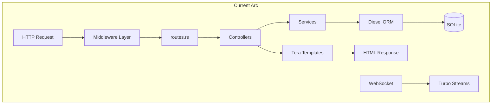
```mermaid
graph TB
    subgraph "Current Arc"
        HTTP[HTTP Request] --> MW[Middleware Layer]
        MW --> Routes[routes.rs]
        Routes --> Controllers
        Controllers --> Services
        Services --> Diesel[Diesel ORM]
        Diesel --> SQLite[(SQLite)]
        Controllers --> Tera[Tera Templates]
        Tera --> HTML[HTML Response]
        WS[WebSocket] --> TurboStream[Turbo Streams]
    end
```

### Key Problems

1. **Tight coupling**: Controllers → Services → Diesel → SQLite is a single pipeline
2. **Mutable state**: CRUD operations lose history — no audit trail, no replay
3. **Monolithic**: UI and backend are one binary, can't run headless microservices
4. **No event bus**: Components can't react to domain events asynchronously
5. **Plugin system is filter-only**: `the-hook` transforms values but doesn't model domain events

---

## 2. Target Architecture: Event-Sourced, Composable Framework

### 2.1 Core Principles

- **Events are the source of truth** — state is derived, never mutated directly
- **Commands produce Events** — every write goes through a command handler
- **Projections build read models** — optimized views materialized from event streams
- **Plugins are optional compositions** — UI, projections, and even event stores are pluggable
- **Core is headless by default** — web UI is a plugin, not a requirement
- **Complexity is opt-in** — simple services can emit events directly; complex domains use full aggregates + command bus

### 2.2 High-Level Architecture

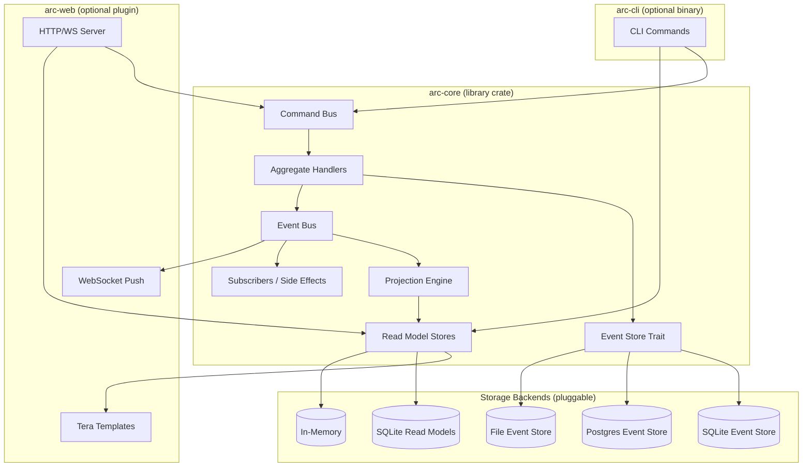
```mermaid
graph TB
    subgraph "arc-core (library crate)"
        CMD[Command Bus] --> AH[Aggregate Handlers]
        AH --> ES[Event Store Trait]
        AH --> EB[Event Bus]
        EB --> PJ[Projection Engine]
        EB --> SUB[Subscribers / Side Effects]
        PJ --> RM[Read Model Stores]
    end

    subgraph "arc-web (optional plugin)"
        HTTP[HTTP/WS Server] --> CMD
        HTTP --> RM
        RM --> Views[Tera Templates]
        EB --> WSPush[WebSocket Push]
    end

    subgraph "arc-cli (optional binary)"
        CLI[CLI Commands] --> CMD
        CLI --> RM
    end

    subgraph "Storage Backends (pluggable)"
        ES --> SQLiteES[(SQLite Event Store)]
        ES --> PgES[(Postgres Event Store)]
        ES --> FileES[(File Event Store)]
        RM --> SQLiteRM[(SQLite Read Models)]
        RM --> InMem[(In-Memory)]
    end
```

### 2.3 Dual Complexity Paths

The framework supports both simple and complex patterns. Developers choose based on their domain:

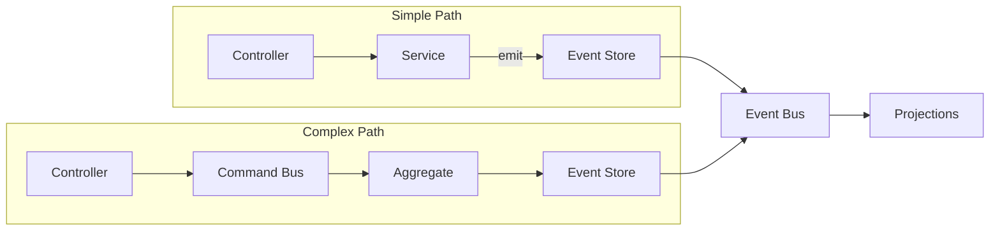
```mermaid
graph LR
    subgraph "Simple Path"
        S_Ctrl[Controller] --> S_Svc[Service]
        S_Svc -->|emit| S_ES[Event Store]
    end
    subgraph "Complex Path"
        C_Ctrl[Controller] --> C_CB[Command Bus]
        C_CB --> C_AG[Aggregate]
        C_AG --> C_ES[Event Store]
    end
    S_ES & C_ES --> EB[Event Bus]
    EB --> Proj[Projections]
```

- **Simple path**: Services validate and emit events directly — minimal ceremony
- **Complex path**: Full aggregates + command bus — strong consistency, domain invariants enforced

### 2.4 Package / Crate Structure

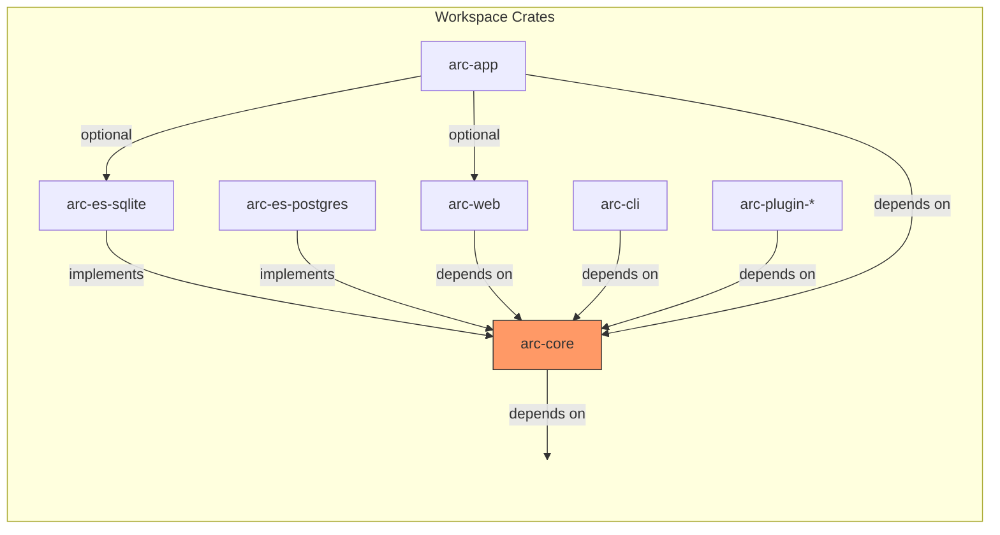
```mermaid
graph LR
    subgraph "Workspace Crates"
        Core[arc-core] --> |depends on| Nothing[ ]
        ES_SQLite[arc-es-sqlite] --> |implements| Core
        ES_Pg[arc-es-postgres] --> |implements| Core
        Web[arc-web] --> |depends on| Core
        CLI[arc-cli] --> |depends on| Core
        Plugins[arc-plugin-*] --> |depends on| Core
        App[arc-app] --> |depends on| Core
        App --> |optional| Web
        App --> |optional| ES_SQLite
    end

    style Core fill:#f96,stroke:#333
    style Nothing fill:none,stroke:none
```

Proposed `Cargo.toml` workspace:

```toml
[workspace]
members = [
    "crates/arc-core",
    "crates/arc-es-sqlite",
    "crates/arc-es-postgres",
    "crates/arc-web",
    "crates/arc-cli",
    "crates/arc-app",
    "plugins/*",
]
```

---

## 3. Core Components

### 3.1 Event Store

The foundational component. All domain state changes are persisted as an append-only log of events.

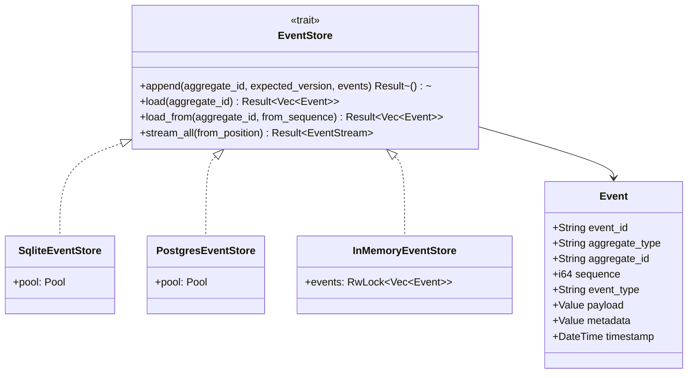
```mermaid
classDiagram
    class Event {
        +String event_id
        +String aggregate_type
        +String aggregate_id
        +i64 sequence
        +String event_type
        +Value payload
        +Value metadata
        +DateTime timestamp
    }

    class EventStore {
        <<trait>>
        +append(aggregate_id, expected_version, events) Result~()~
        +load(aggregate_id) Result~Vec~Event~~
        +load_from(aggregate_id, from_sequence) Result~Vec~Event~~
        +stream_all(from_position) Result~EventStream~
    }

    class SqliteEventStore {
        +pool: Pool
    }

    class PostgresEventStore {
        +pool: Pool
    }

    class InMemoryEventStore {
        +events: RwLock~Vec~Event~~
    }

    EventStore <|.. SqliteEventStore
    EventStore <|.. PostgresEventStore
    EventStore <|.. InMemoryEventStore
    EventStore --> Event
```

**Schema for SQLite event store:**

```sql
CREATE TABLE events (
    id INTEGER PRIMARY KEY AUTOINCREMENT,
    aggregate_type TEXT NOT NULL,
    aggregate_id TEXT NOT NULL,
    sequence INTEGER NOT NULL,
    event_type TEXT NOT NULL,
    payload TEXT NOT NULL,        -- JSON
    metadata TEXT DEFAULT '{}',   -- JSON (causation_id, correlation_id, user_id, etc.)
    timestamp TEXT NOT NULL DEFAULT (datetime('now')),
    UNIQUE(aggregate_id, sequence)
);

CREATE INDEX idx_events_aggregate ON events(aggregate_id, sequence);
CREATE INDEX idx_events_type ON events(event_type);
CREATE INDEX idx_events_timestamp ON events(timestamp);
```

### 3.2 Aggregates & Commands

Aggregates encapsulate domain logic. Commands are validated and produce events.

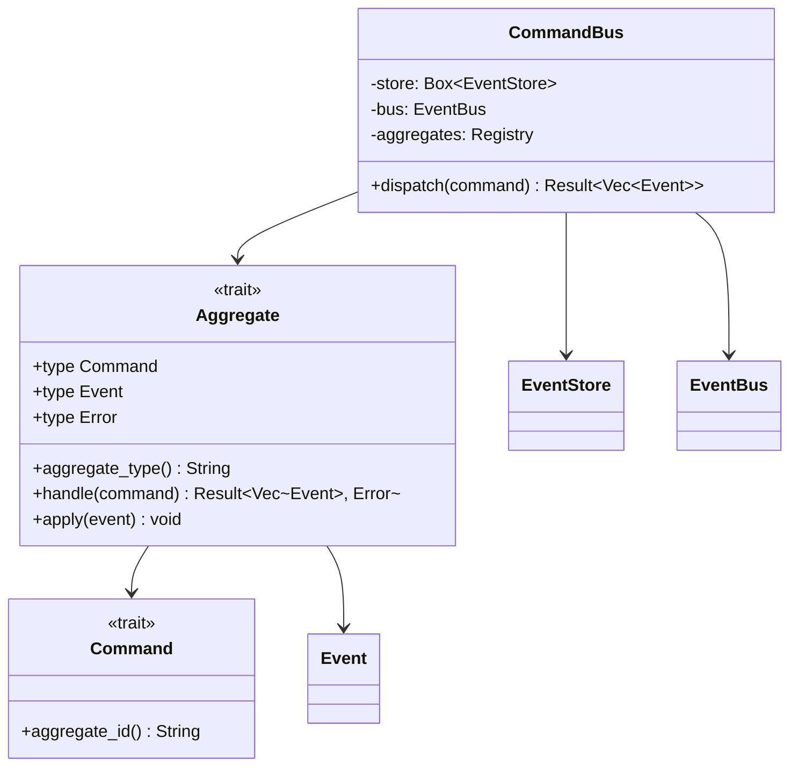
```mermaid
classDiagram
    class Aggregate {
        <<trait>>
        +type Command
        +type Event
        +type Error
        +aggregate_type() String
        +handle(command) Result~Vec~Event~, Error~
        +apply(event) void
    }

    class Command {
        <<trait>>
        +aggregate_id() String
    }

    class CommandBus {
        +dispatch(command) Result~Vec~Event~~
        -store: Box~EventStore~
        -bus: EventBus
        -aggregates: Registry
    }

    CommandBus --> Aggregate
    CommandBus --> EventStore
    CommandBus --> EventBus
    Aggregate --> Command
    Aggregate --> Event
```

**Example — User aggregate:**

```rust
pub struct UserAggregate {
    id: Option<String>,
    email: Option<String>,
    name: Option<String>,
    password_hash: Option<String>,
    created: bool,
}

// Commands
pub enum UserCommand {
    CreateUser { id: String, name: String, email: String, password: String },
    UpdateProfile { id: String, name: String },
    ChangePassword { id: String, old_password: String, new_password: String },
    DeleteUser { id: String },
}

// Events
pub enum UserEvent {
    UserCreated { id: String, name: String, email: String, password_hash: String, at: DateTime },
    ProfileUpdated { id: String, name: String, at: DateTime },
    PasswordChanged { id: String, at: DateTime },
    UserDeleted { id: String, at: DateTime },
}
```

### 3.3 Event Bus

Decouples event producers from consumers. Supports sync and async subscribers.

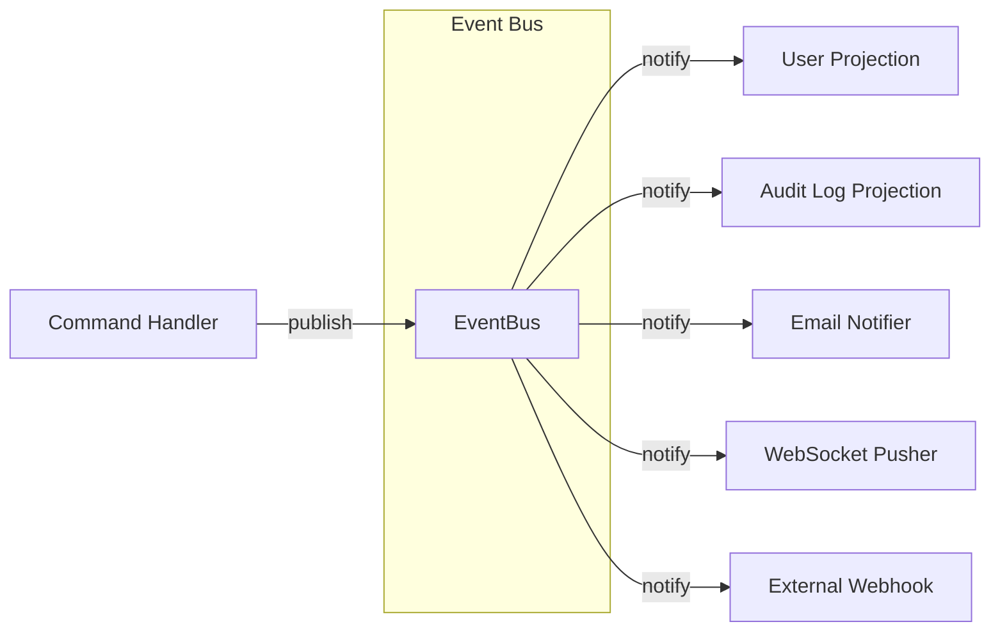
```mermaid
graph LR
    subgraph "Event Bus"
        EB[EventBus]
    end

    CMD[Command Handler] -->|publish| EB
    EB -->|notify| P1[User Projection]
    EB -->|notify| P2[Audit Log Projection]
    EB -->|notify| S1[Email Notifier]
    EB -->|notify| S2[WebSocket Pusher]
    EB -->|notify| S3[External Webhook]
```

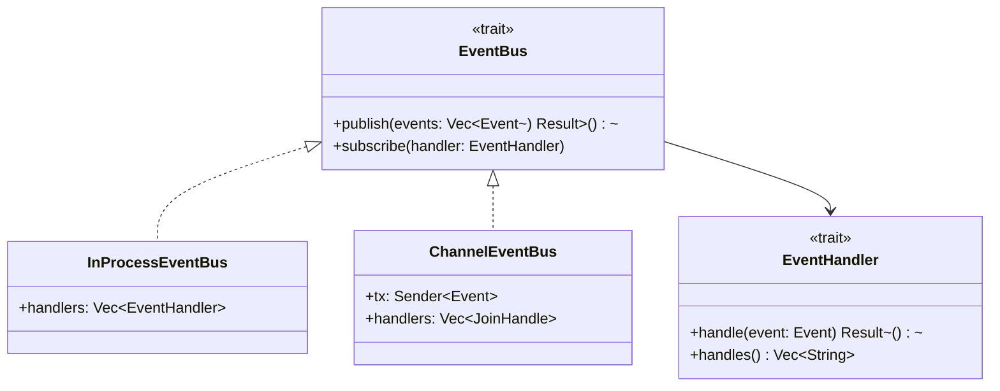
```mermaid
classDiagram
    class EventBus {
        <<trait>>
        +publish(events: Vec~Event~) Result~()~
        +subscribe(handler: EventHandler)
    }

    class EventHandler {
        <<trait>>
        +handle(event: Event) Result~()~
        +handles() Vec~String~
    }

    class InProcessEventBus {
        +handlers: Vec~EventHandler~
    }

    class ChannelEventBus {
        +tx: Sender~Event~
        +handlers: Vec~JoinHandle~
    }

    EventBus <|.. InProcessEventBus
    EventBus <|.. ChannelEventBus
    EventBus --> EventHandler
```

### 3.4 Projections (Read Models)

Projections consume events and build query-optimized read models.

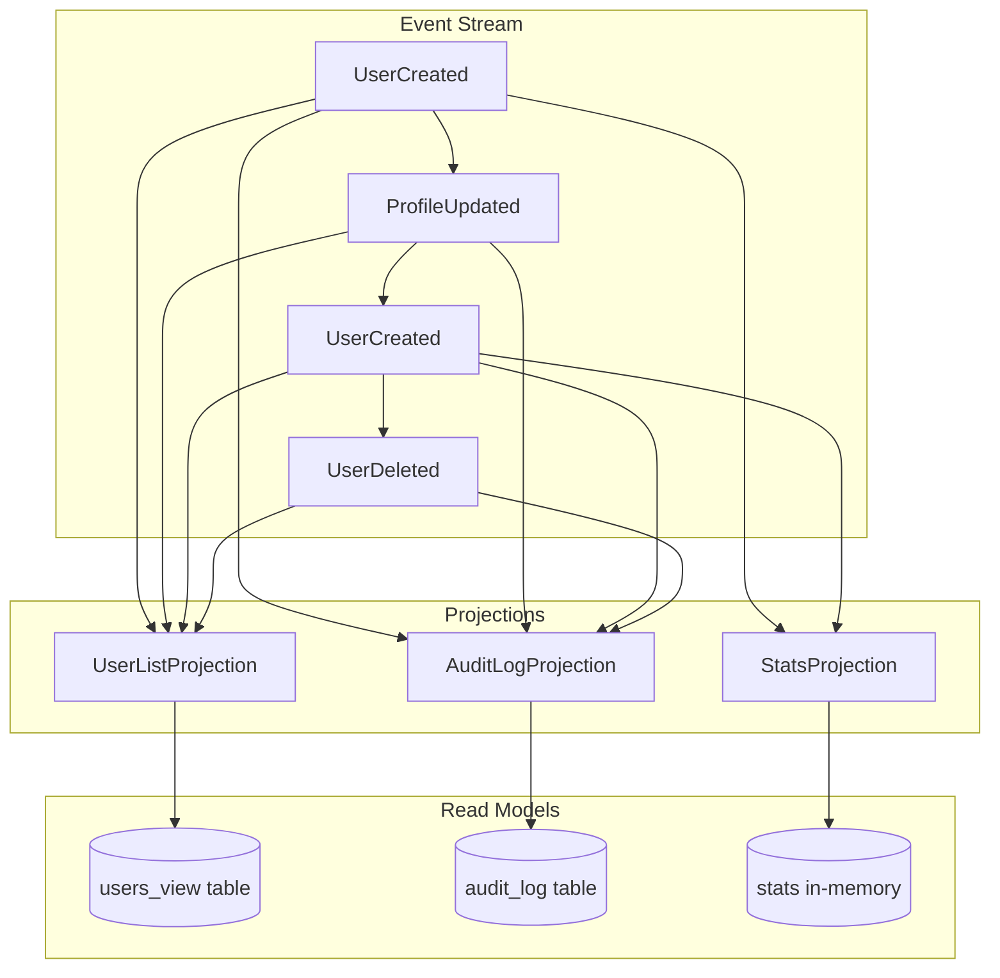
```mermaid
graph TB
    subgraph "Event Stream"
        E1[UserCreated] --> E2[ProfileUpdated] --> E3[UserCreated] --> E4[UserDeleted]
    end

    subgraph "Projections"
        E1 & E2 & E3 & E4 --> UP[UserListProjection]
        E1 & E2 & E3 & E4 --> AP[AuditLogProjection]
        E1 & E3 --> SP[StatsProjection]
    end

    subgraph "Read Models"
        UP --> UsersTable[(users_view table)]
        AP --> AuditTable[(audit_log table)]
        SP --> StatsTable[(stats in-memory)]
    end
```

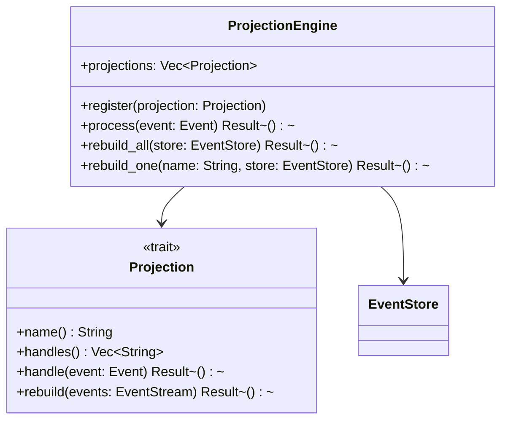
```mermaid
classDiagram
    class Projection {
        <<trait>>
        +name() String
        +handles() Vec~String~
        +handle(event: Event) Result~()~
        +rebuild(events: EventStream) Result~()~
    }

    class ProjectionEngine {
        +projections: Vec~Projection~
        +register(projection: Projection)
        +process(event: Event) Result~()~
        +rebuild_all(store: EventStore) Result~()~
        +rebuild_one(name: String, store: EventStore) Result~()~
    }

    ProjectionEngine --> Projection
    ProjectionEngine --> EventStore
```

**Key capability**: Projections can be rebuilt from scratch by replaying the entire event stream. This enables:
- Schema changes without data migration
- New read models added retroactively
- Bug fixes by replaying with corrected projection logic

### 3.5 Snapshot Store (Optional)

For aggregates with many events, snapshots avoid replaying the full history.

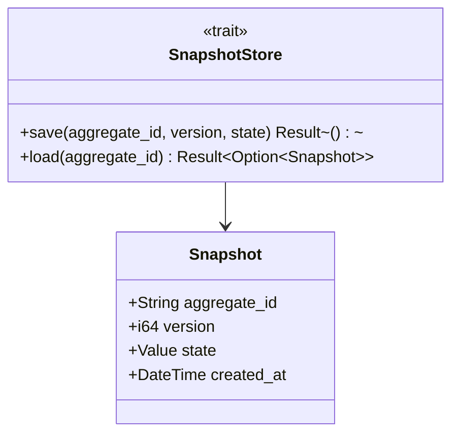
```mermaid
classDiagram
    class SnapshotStore {
        <<trait>>
        +save(aggregate_id, version, state) Result~()~
        +load(aggregate_id) Result~Option~Snapshot~~
    }

    class Snapshot {
        +String aggregate_id
        +i64 version
        +Value state
        +DateTime created_at
    }

    SnapshotStore --> Snapshot
```

---

## 4. Plugin / Composability System

### 4.1 Plugin Trait

Building on the existing `plugin-system-plan.md`, plugins now interact with the ES core:

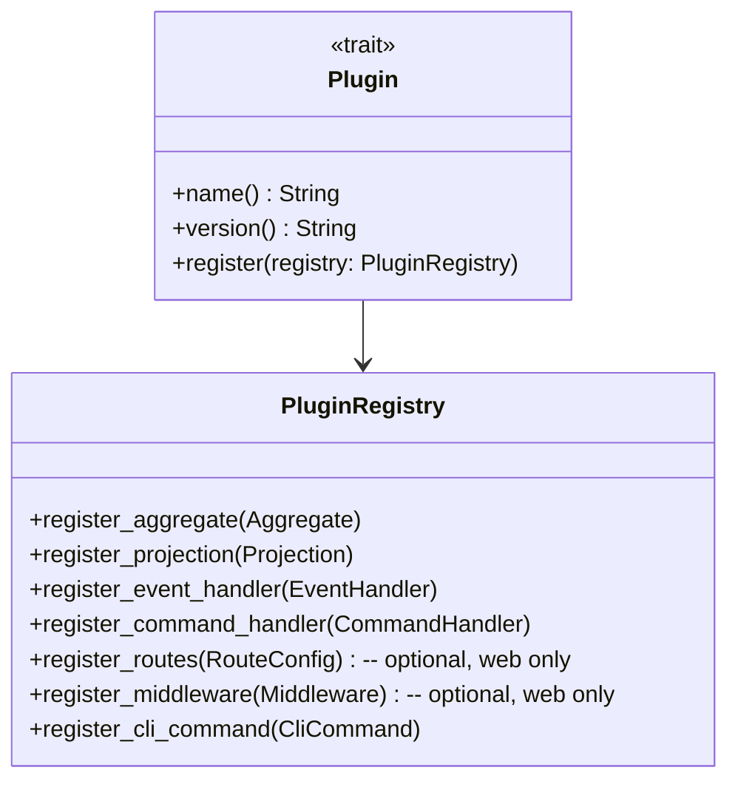
```mermaid
classDiagram
    class Plugin {
        <<trait>>
        +name() String
        +version() String
        +register(registry: PluginRegistry)
    }

    class PluginRegistry {
        +register_aggregate(Aggregate)
        +register_projection(Projection)
        +register_event_handler(EventHandler)
        +register_command_handler(CommandHandler)
        +register_routes(RouteConfig)  -- optional, web only
        +register_middleware(Middleware) -- optional, web only
        +register_cli_command(CliCommand)
    }

    Plugin --> PluginRegistry
```

**Example: A "Blog" plugin as a separate crate:**

```rust
// plugins/arc-plugin-blog/src/lib.rs
pub struct BlogPlugin;

impl Plugin for BlogPlugin {
    fn name(&self) -> &str { "blog" }
    fn version(&self) -> &str { "0.1.0" }

    fn register(&self, reg: &mut PluginRegistry) {
        // Domain
        reg.register_aggregate::<BlogPostAggregate>();
        reg.register_projection(Box::new(BlogListProjection::new()));
        reg.register_event_handler(Box::new(BlogSearchIndexer::new()));

        // Web (only if arc-web is present)
        #[cfg(feature = "web")]
        {
            reg.register_routes(blog_routes::config);
        }

        // CLI
        reg.register_cli_command("blog:rebuild", blog_cli::rebuild_projections);
    }
}
```

### 4.2 Composition Modes

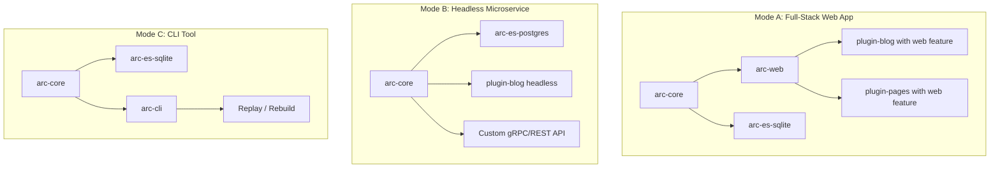
```mermaid
graph TB
    subgraph "Mode A: Full-Stack Web App"
        A_Core[arc-core] --> A_Web[arc-web]
        A_Core --> A_ES[arc-es-sqlite]
        A_Web --> A_Blog[plugin-blog with web feature]
        A_Web --> A_Pages[plugin-pages with web feature]
    end

    subgraph "Mode B: Headless Microservice"
        B_Core[arc-core] --> B_ES[arc-es-postgres]
        B_Core --> B_Blog[plugin-blog headless]
        B_Core --> B_API[Custom gRPC/REST API]
    end

    subgraph "Mode C: CLI Tool"
        C_Core[arc-core] --> C_ES[arc-es-sqlite]
        C_Core --> C_CLI[arc-cli]
        C_CLI --> C_Replay[Replay / Rebuild]
    end
```

---

## 5. Data Flow: Full Request Lifecycle

### 5.1 Write Path (Command)

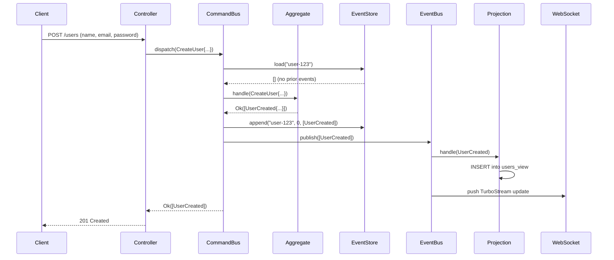
```mermaid
sequenceDiagram
    participant Client
    participant Controller
    participant CommandBus
    participant Aggregate
    participant EventStore
    participant EventBus
    participant Projection
    participant WebSocket

    Client->>Controller: POST /users (name, email, password)
    Controller->>CommandBus: dispatch(CreateUser{...})
    CommandBus->>EventStore: load("user-123")
    EventStore-->>CommandBus: [] (no prior events)
    CommandBus->>Aggregate: handle(CreateUser{...})
    Aggregate-->>CommandBus: Ok([UserCreated{...}])
    CommandBus->>EventStore: append("user-123", 0, [UserCreated])
    CommandBus->>EventBus: publish([UserCreated])
    EventBus->>Projection: handle(UserCreated)
    Projection->>Projection: INSERT into users_view
    EventBus->>WebSocket: push TurboStream update
    CommandBus-->>Controller: Ok([UserCreated])
    Controller-->>Client: 201 Created
```

### 5.2 Read Path (Query)

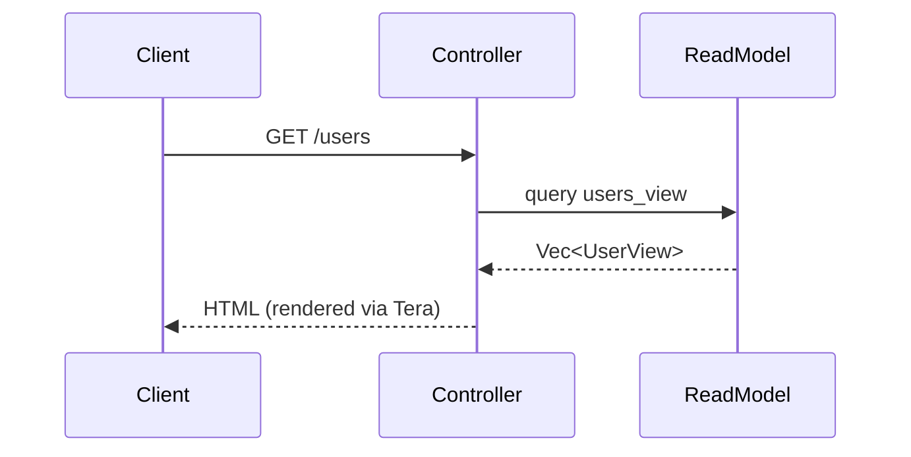
```mermaid
sequenceDiagram
    participant Client
    participant Controller
    participant ReadModel

    Client->>Controller: GET /users
    Controller->>ReadModel: query users_view
    ReadModel-->>Controller: Vec<UserView>
    Controller-->>Client: HTML (rendered via Tera)
```

### 5.3 Projection Rebuild

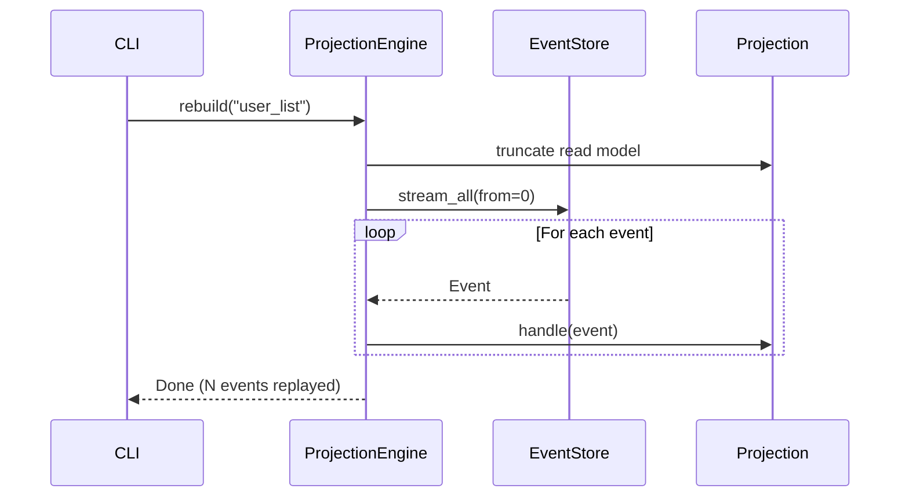
```mermaid
sequenceDiagram
    participant CLI
    participant ProjectionEngine
    participant EventStore
    participant Projection

    CLI->>ProjectionEngine: rebuild("user_list")
    ProjectionEngine->>Projection: truncate read model
    ProjectionEngine->>EventStore: stream_all(from=0)
    loop For each event
        EventStore-->>ProjectionEngine: Event
        ProjectionEngine->>Projection: handle(event)
    end
    ProjectionEngine-->>CLI: Done (N events replayed)
```

---

## 6. Migration Strategy from Current State

### Phase 1: Extract Core Library

```
arc/                    arc/
├── src/                     ├── crates/
│   ├── main.rs              │   ├── arc-core/
│   ├── routes.rs    ──►     │   │   ├── src/
│   ├── models/              │   │   │   ├── aggregate.rs
│   ├── services/            │   │   │   ├── command.rs
│   └── helpers/             │   │   │   ├── event.rs
└── ...                      │   │   │   ├── event_store.rs
                             │   │   │   ├── event_bus.rs
                             │   │   │   ├── projection.rs
                             │   │   │   └── lib.rs
                             │   ├── arc-web/
                             │   │   ├── src/ (actix, tera, routes)
                             │   └── arc-app/
                             │       └── src/main.rs
                             └── plugins/
```

### Phase 2: Introduce Event Store alongside Diesel

Keep Diesel for read models. Add event store for writes. Dual-write during transition:

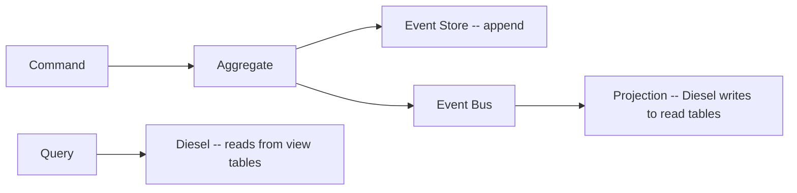
```mermaid
graph LR
    CMD[Command] --> AG[Aggregate]
    AG --> ES[Event Store -- append]
    AG --> EB[Event Bus]
    EB --> PJ[Projection -- Diesel writes to read tables]
    
    Query[Query] --> Diesel[Diesel -- reads from view tables]
```

### Phase 3: Full ES — Remove Direct Diesel Writes

All write operations go through commands. Diesel is used only in projections for read model tables.

### Phase 4: Extract Plugins

Move features (pages, blog, auth) into plugin crates that register their own aggregates, projections, and routes.

---

## 7. Component Checklist

| Component | Crate | Priority | Status |
|-----------|-------|----------|--------|
| `Event` type + serialization | `arc-core` | P0 | New |
| `EventStore` trait | `arc-core` | P0 | New |
| SQLite EventStore impl | `arc-es-sqlite` | P0 | New |
| `EventBus` trait + in-process impl | `arc-core` | P0 | New |
| `Projection` trait + engine | `arc-core` | P0 | New |
| `Aggregate` trait | `arc-core` | P1 | New |
| `CommandBus` | `arc-core` | P1 | New |
| `PluginRegistry` (ES-aware) | `arc-core` | P1 | Extend existing plan |
| Snapshot store | `arc-core` | P2 | New |
| Postgres EventStore impl | `arc-es-postgres` | P2 | New |
| Web crate extraction | `arc-web` | P1 | Refactor |
| CLI crate (replay, rebuild) | `arc-cli` | P1 | Refactor |
| Async event bus (tokio channels) | `arc-core` | P2 | New |
| `the-hook` async support | `the-hook` | P2 | Extend |
| Saga / Process Manager | `arc-core` | P3 | New |

---

## 8. Example: Full User Domain with ES

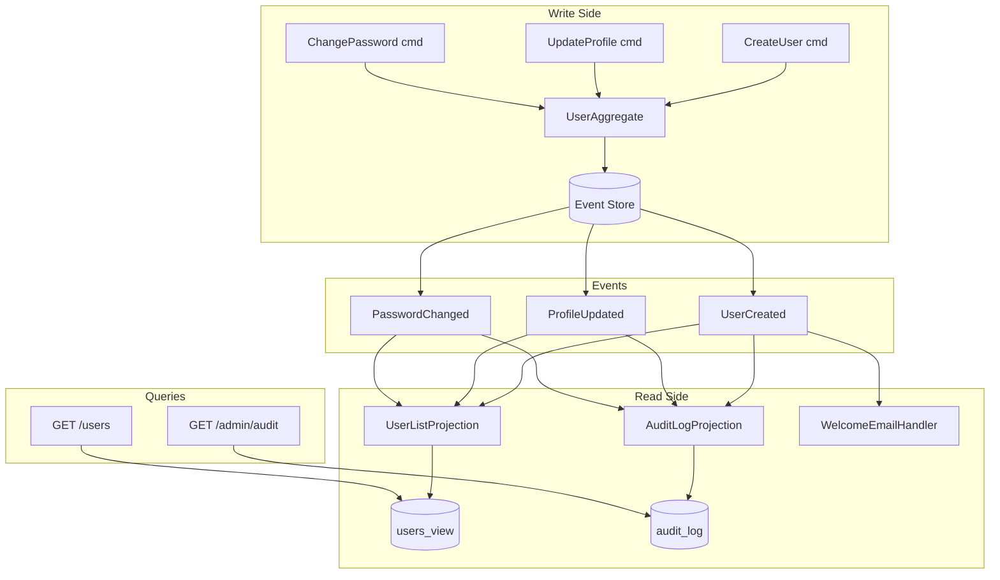
```mermaid
graph TB
    subgraph "Write Side"
        CreateUser[CreateUser cmd] --> UA[UserAggregate]
        UpdateProfile[UpdateProfile cmd] --> UA
        ChangePassword[ChangePassword cmd] --> UA
        UA --> ES[(Event Store)]
    end

    subgraph "Events"
        ES --> E1[UserCreated]
        ES --> E2[ProfileUpdated]
        ES --> E3[PasswordChanged]
    end

    subgraph "Read Side"
        E1 & E2 & E3 --> ULP[UserListProjection]
        E1 & E2 & E3 --> ALP[AuditLogProjection]
        E1 --> WE[WelcomeEmailHandler]
        ULP --> UV[(users_view)]
        ALP --> AL[(audit_log)]
    end

    subgraph "Queries"
        GET[GET /users] --> UV
        GET2[GET /admin/audit] --> AL
    end
```

---

## 9. Distributed Nodes & Cluster Architecture

### 9.1 The Problem Space

When multiple Arc apps need to work together — scaling horizontally, distributing workload, and sharing events across nodes.

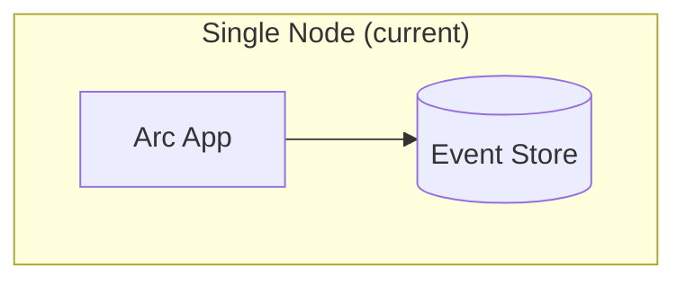
```mermaid
graph TB
    subgraph "Single Node (current)"
        App[Arc App]
        ES[(Event Store)]
        App --> ES
    end
```

### 9.2 Architecture: Pluggable Cluster with Local-First Storage

Each node owns its local SQLite event store. Cluster traits in `arc-core` define how nodes discover each other, sync events, and distribute workload. Backend implementations are swappable.

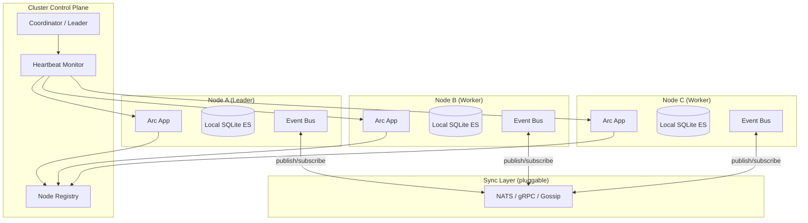
```mermaid
graph TB
    subgraph "Cluster Control Plane"
        REG[Node Registry]
        COORD[Coordinator / Leader]
        HB[Heartbeat Monitor]
    end

    subgraph "Node A (Leader)"
        A_App[Arc App]
        A_ES[(Local SQLite ES)]
        A_Bus[Event Bus]
    end

    subgraph "Node B (Worker)"
        B_App[Arc App]
        B_ES[(Local SQLite ES)]
        B_Bus[Event Bus]
    end

    subgraph "Node C (Worker)"
        C_App[Arc App]
        C_ES[(Local SQLite ES)]
        C_Bus[Event Bus]
    end

    subgraph "Sync Layer (pluggable)"
        MQ[NATS / gRPC / Gossip]
    end

    A_App & B_App & C_App --> REG
    COORD --> HB
    HB --> A_App & B_App & C_App

    A_Bus <-->|publish/subscribe| MQ
    B_Bus <-->|publish/subscribe| MQ
    C_Bus <-->|publish/subscribe| MQ
```

### 9.3 Core Distributed Components

```mermaid
classDiagram
    class NodeIdentity {
        +String node_id
        +String address
        +u16 port
        +Vec~String~ capabilities
        +NodeRole role
        +DateTime registered_at
        +DateTime last_heartbeat
    }

    class NodeRegistry {
        <<trait>>
        +register(identity: NodeIdentity) Result
        +deregister(node_id: String) Result
        +discover() Result~Vec~NodeIdentity~~
        +heartbeat(node_id: String) Result
        +on_node_join(handler: Fn)
        +on_node_leave(handler: Fn)
    }

    class ClusterEventBus {
        <<trait>>
        +publish_remote(events: Vec~Event~) Result
        +subscribe_remote(handler: EventHandler) Result
        +partitions() Vec~Partition~
    }

    class WorkloadDistributor {
        <<trait>>
        +assign(command: Command) Result~NodeIdentity~
        +rebalance() Result
        +node_load(node_id: String) Result~LoadMetrics~
    }

    class LeaderElection {
        <<trait>>
        +elect() Result~NodeIdentity~
        +current_leader() Option~NodeIdentity~
        +on_leader_change(handler: Fn)
    }

    NodeRegistry --> NodeIdentity
    WorkloadDistributor --> NodeIdentity
    LeaderElection --> NodeIdentity
```

### 9.4 Local SQLite per Node with Aggregate Partitioning

Each node owns its local SQLite event store. Aggregate partitioning via consistent hashing ensures only one node writes to a given aggregate — eliminating conflicts without distributed locking.

```mermaid
graph TB
    subgraph "Node A (owns aggregates 0-3)"
        A_CMD[Commands] --> A_AG[Aggregates]
        A_AG --> A_ES[(Local SQLite ES)]
        A_AG --> A_PUB[Publish events]
    end

    subgraph "Node B (owns aggregates 4-7)"
        B_CMD[Commands] --> B_AG[Aggregates]
        B_AG --> B_ES[(Local SQLite ES)]
        B_AG --> B_PUB[Publish events]
    end

    subgraph "Node C (owns aggregates 8-11)"
        C_CMD[Commands] --> C_AG[Aggregates]
        C_AG --> C_ES[(Local SQLite ES)]
        C_AG --> C_PUB[Publish events]
    end

    subgraph "Sync Layer"
        SYNC[NATS / gRPC / Direct]
    end

    A_PUB --> SYNC
    B_PUB --> SYNC
    C_PUB --> SYNC
    SYNC --> A_PROJ[Node A Projections]
    SYNC --> B_PROJ[Node B Projections]
    SYNC --> C_PROJ[Node C Projections]
```

**How it works:**
- Each node runs its own embedded SQLite — zero shared infrastructure
- Aggregates are partitioned across nodes via consistent hashing of `aggregate_id`
- Commands arriving at the wrong node are forwarded to the owning node
- The owning node appends events to its local SQLite and publishes them to the sync layer
- All nodes receive all events and update their local projections (eventual consistency)
- If a node goes down, its partitions are reassigned and the new owner replays from the sync layer's retention

**Command forwarding flow:**

```mermaid
sequenceDiagram
    participant Client
    participant LB as Load Balancer
    participant NodeA as Node A
    participant NodeB as Node B (owns user-xyz)

    Client->>LB: CreateUser(user-xyz)
    LB->>NodeA: CreateUser(user-xyz)
    NodeA->>NodeA: hash("user-xyz") → partition 5 → Node B
    NodeA->>NodeB: Forward command
    NodeB->>NodeB: Process command, append to local SQLite
    NodeB->>NodeA: Publish UserCreated event (via sync)
    NodeA->>NodeA: Update local projections
```

### 9.5 Pluggable Cluster Backends

```mermaid
graph TB
    subgraph "arc-core"
        NT[NodeRegistry trait]
        CEB[ClusterEventBus trait]
        WD[WorkloadDistributor trait]
        LE[LeaderElection trait]
    end

    subgraph "arc-cluster-nats"
        NATS_NR[NatsNodeRegistry]
        NATS_CEB[NatsClusterEventBus]
        NATS_WD[NatsWorkloadDistributor]
    end

    subgraph "arc-cluster-p2p"
        P2P_NR[GossipNodeRegistry]
        P2P_CEB[GrpcClusterEventBus]
        P2P_LE[RaftLeaderElection]
    end

    subgraph "arc-cluster-k8s"
        K8S_NR[K8sNodeRegistry]
    end

    NT <|.. NATS_NR
    NT <|.. P2P_NR
    NT <|.. K8S_NR
    CEB <|.. NATS_CEB
    CEB <|.. P2P_CEB
    LE <|.. P2P_LE
```

Available backends:

| Backend | Discovery | Sync | Leader Election | Best For |
|---------|-----------|------|-----------------|----------|
| **NATS JetStream** | NATS subjects | NATS pub/sub with persistence | Lease via NATS KV | Cloud, k8s, general purpose |
| **P2P / Gossip** | SWIM gossip + seed nodes | gRPC streaming | Raft consensus | Edge, IoT, zero-dependency |
| **K8s Native** | Headless Service DNS / API | Combine with NATS or gRPC | Lease via k8s ConfigMap | Kubernetes-only deployments |
| **Postgres** | Registry table | LISTEN/NOTIFY | Lease via advisory lock | When Postgres is already available |

### 9.6 Workload Distribution Strategies

```mermaid
graph LR
    subgraph "Strategy: Aggregate Partitioning"
        CMD[CreateUser user-abc] --> HASH[hash 'user-abc' mod N]
        HASH --> P2[Partition 2]
        P2 --> NodeB[Node B owns partition 2]
    end
```

| Strategy | How | Trade-off |
|----------|-----|-----------|
| **Aggregate partitioning** | Consistent hash of aggregate_id → node | Single owner per aggregate, no conflicts, rebalance on node change |
| **Round-robin commands** | Load balancer distributes commands evenly | Needs distributed locking per aggregate |
| **Sticky sessions** | Route all commands for an aggregate to same node (via gateway) | Simple, but uneven load |
| **Claim-based** | Node "claims" aggregates on first access, registers in registry | Self-organizing, but needs lease/expiry |

**Recommended**: Aggregate partitioning — deterministic, conflict-free, rebalances cleanly.

### 9.7 Event Synchronization

```mermaid
sequenceDiagram
    participant NodeA as Node A (owner)
    participant Broker as Sync Layer
    participant NodeB as Node B (subscriber)
    participant NodeC as Node C (subscriber)

    NodeA->>NodeA: Command → Aggregate → Events
    NodeA->>NodeA: Append to local EventStore
    NodeA->>Broker: Publish events
    Broker->>NodeB: Deliver events
    Broker->>NodeC: Deliver events
    NodeB->>NodeB: Update projections
    NodeC->>NodeC: Update projections

    Note over NodeB,NodeC: Eventual consistency:<br/>projections lag by sync latency
```

**Consistency guarantees by layer:**

| Layer | Consistency | Mechanism |
|-------|-------------|-----------|
| Single aggregate | Strong | Optimistic concurrency (expected_version) |
| Local projections | Strong | Same-process event handling |
| Cross-node projections | Eventual | Sync delivery + idempotent handlers |
| Cross-aggregate queries | Eventual | Projection convergence |

### 9.8 Node Lifecycle

```mermaid
stateDiagram-v2
    [*] --> Joining: Node starts
    Joining --> Registering: Connect to seed/registry
    Registering --> Syncing: Registered, receive partition map
    Syncing --> Active: Caught up on event streams
    Active --> Draining: Graceful shutdown / scale-down
    Draining --> Deregistered: Partitions reassigned
    Deregistered --> [*]

    Active --> Suspected: Missed heartbeats
    Suspected --> Active: Heartbeat recovered
    Suspected --> Failed: Timeout exceeded
    Failed --> Deregistered: Partitions reassigned
```

### 9.9 Kubernetes Integration

```mermaid
graph TB
    subgraph "Kubernetes Cluster"
        subgraph "StatefulSet: arc"
            Pod0[arc-0<br/>Leader]
            Pod1[arc-1<br/>Worker]
            Pod2[arc-2<br/>Worker]
        end

        SVC[Headless Service<br/>arc-headless]
        LB_SVC[LoadBalancer Service<br/>arc-web]

        subgraph "Infra (optional)"
            NATS_SS[NATS StatefulSet]
        end
    end

    LB_SVC --> Pod0 & Pod1 & Pod2
    Pod0 & Pod1 & Pod2 --> SVC
    Pod0 & Pod1 & Pod2 --> NATS_SS
```

**K8s-native discovery:**

```rust
// arc-cluster-k8s crate
pub struct K8sNodeRegistry {
    namespace: String,
    service_name: String,  // headless service
    kube_client: kube::Client,
}

impl NodeRegistry for K8sNodeRegistry {
    async fn discover(&self) -> Result<Vec<NodeIdentity>> {
        // DNS SRV lookup on headless service
        // or use kube API to list pod endpoints
        let endpoints = self.kube_client
            .list::<Endpoints>(&self.namespace)
            .await?;
        // ...
    }
}
```

**Autoscaling:** HPA (Horizontal Pod Autoscaler) scales pods based on command queue depth or event throughput:

```yaml
apiVersion: autoscaling/v2
kind: HorizontalPodAutoscaler
metadata:
  name: arc
spec:
  scaleTargetRef:
    apiVersion: apps/v1
    kind: StatefulSet
    name: arc
  minReplicas: 2
  maxReplicas: 20
  metrics:
    - type: Pods
      pods:
        metric:
          name: arc_command_queue_depth
        target:
          type: AverageValue
          averageValue: "100"
```

---

## 10. Implementation Roadmap

```mermaid
gantt
    title Arc ES + Cluster Roadmap
    dateFormat YYYY-Q
    section Phase 1 - ES Core
        Event type + EventStore trait   :2025-Q1, 1q
        SQLite EventStore impl          :2025-Q1, 1q
        EventBus + Projections          :2025-Q1, 1q
        Aggregate + CommandBus          :2025-Q1, 1q
    section Phase 2 - Composability
        Workspace crate extraction      :2025-Q2, 1q
        Plugin registry (ES-aware)      :2025-Q2, 1q
        arc-web extraction         :2025-Q2, 1q
        arc-cli                    :2025-Q2, 1q
    section Phase 3 - Cluster
        Cluster traits in core          :2025-Q3, 1q
        Local SQLite per node           :2025-Q3, 1q
        Aggregate partitioning          :2025-Q3, 1q
        NATS sync backend               :2025-Q3, 1q
    section Phase 4 - Advanced
        K8s discovery                   :2025-Q4, 1q
        P2P gossip backend              :2025-Q4, 1q
        Raft leader election            :2025-Q4, 1q
        Auto-rebalancing                :2025-Q4, 1q
```

---

## 11. Final Crate Map

```mermaid
graph LR
    subgraph "Core"
        Core[arc-core<br/>events, aggregates, traits]
    end

    subgraph "Event Stores"
        ES_SQLite[arc-es-sqlite]
        ES_Pg[arc-es-postgres]
    end

    subgraph "Cluster Backends"
        CL_NATS[arc-cluster-nats]
        CL_P2P[arc-cluster-p2p]
        CL_K8S[arc-cluster-k8s]
    end

    subgraph "Surfaces"
        Web[arc-web]
        CLI[arc-cli]
    end

    subgraph "Plugins"
        PAuth[plugin-auth]
        PBlog[plugin-blog]
        PPages[plugin-pages]
    end

    Core --> ES_SQLite & ES_Pg
    Core --> CL_NATS & CL_P2P & CL_K8S
    Core --> Web & CLI
    Core --> PAuth & PBlog & PPages

    style Core fill:#f96,stroke:#333
```

---

## 12. Summary

Arc evolves from a monolithic MVC starter into a **composable, event-sourced framework** where:

1. **Events are first-class citizens** — every state change is an event
2. **Core is headless** — `arc-core` has zero web dependencies
3. **Web is a plugin** — `arc-web` adds Actix, Tera, WebSocket
4. **Each node is self-contained** — local SQLite event store, no shared DB dependency
5. **Nodes sync via eventual consistency** — events replicated through pluggable sync layer
6. **Aggregate ownership eliminates conflicts** — consistent hashing assigns one writer per aggregate
7. **Storage is pluggable** — SQLite (primary), Postgres (optional), or in-memory event stores
8. **Cluster backends are pluggable** — NATS, gRPC, P2P gossip, or k8s-native discovery
9. **Plugins compose freely** — register aggregates, projections, routes, CLI commands
10. **Complexity is opt-in** — simple services or full CQRS, developer's choice
