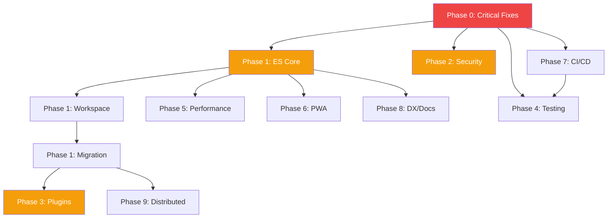

# Arc Development Roadmap

> Comprehensive development plan synthesized from architecture, security, reliability, QA, UX/DX, and CI/CD specialist reviews.

**Last Updated**: 2026-02-27

---

## Executive Summary

Arc is evolving from a traditional MVC Rust web starter into a **composable, event-sourced framework** with plugin architecture and distributed capabilities. This roadmap prioritizes:

1. **Critical fixes** (security, performance bugs)
2. **Event sourcing foundation** (core library, event store)
3. **Security hardening** (rate limiting, session security)
4. **Plugin system** (extensibility, modularity)
5. **Quality & reliability** (testing, monitoring)
6. **Developer experience** (tooling, documentation)
7. **Advanced features** (PWA, clustering, distributed architecture)

---

## Priority Matrix

| Priority | Focus | Timeline |
|----------|-------|----------|
| **P0** | Critical bugs, security issues | Immediate (1-2 weeks) |
| **P1** | Event sourcing core, plugin system | Short-term (1-3 months) |
| **P2** | Testing, PWA, performance | Medium-term (3-6 months) |
| **P3** | Distributed architecture, advanced features | Long-term (6-12 months) |

---

## Phase 0: Critical Fixes & Quick Wins (P0)

**Timeline**: 1-2 weeks
**Status**: ✅ Mostly Complete

### Completed Items

- [x] **Fix unused variable warnings** - auth_middleware.rs, auth_controller.rs
- [x] **Add Docsify documentation** - Visual documentation browser
- [x] **Connection pool fix** - Use lazy static to avoid recreation
- [x] **Session message bug** - Return correct field for success messages
- [x] **Remove password logging** - Security vulnerability fixed
- [x] **CSRF protection** - Token generation and validation implemented

### Remaining P0 Items

- [ ] **Add input validation** (High Priority)
  - Email format validation
  - Password strength requirements
  - Name/field length limits
  - Use `validator` crate
  - **Assignee**: Backend team
  - **Effort**: 4-6 hours

- [ ] **Add proper logging** (High Priority)
  - Replace `println!` with `tracing` crate
  - Configure log levels (DEBUG, INFO, WARN, ERROR)
  - Add structured logging for audit trail
  - **Assignee**: Backend team
  - **Effort**: 3-4 hours

- [ ] **Fix template reinitialization** (High Priority)
  - Use lazy static for Tera engine
  - Significant performance improvement
  - **Assignee**: Backend team
  - **Effort**: 1-2 hours

- [ ] **Remove unused imports** (Low Priority)
  - Clean up user.rs, other modules
  - **Assignee**: Any developer
  - **Effort**: 30 minutes

---

## Phase 1: Event Sourcing Foundation (P1)

**Timeline**: 3-4 months
**Status**: 🟡 Planning Complete, Ready to Implement

### 1.1 Core Event Sourcing Library

**Epic**: Create `arc-core` crate with ES primitives

- [ ] **Design Event type**
  - `Event` struct with metadata (aggregate_id, sequence, timestamp, payload)
  - Serialization support (serde_json)
  - **Effort**: 1 week
  - **Dependencies**: None

- [ ] **EventStore trait**
  - `append()`, `load()`, `load_from()`, `stream_all()` methods
  - Optimistic concurrency control (expected_version)
  - **Effort**: 1 week
  - **Dependencies**: Event type

- [ ] **SQLite EventStore implementation**
  - Create events table schema (see architecture doc)
  - Implement EventStore trait
  - Add indexes for performance
  - **Effort**: 1-2 weeks
  - **Dependencies**: EventStore trait

- [ ] **EventBus trait + InProcessEventBus**
  - Pub/sub for events
  - Synchronous event handling
  - **Effort**: 1 week
  - **Dependencies**: Event type

- [ ] **Projection trait + ProjectionEngine**
  - Handle events to build read models
  - Rebuild capability from event stream
  - **Effort**: 2 weeks
  - **Dependencies**: EventBus, EventStore

- [ ] **Aggregate trait**
  - Command handling
  - Event application
  - State reconstruction from events
  - **Effort**: 1 week
  - **Dependencies**: Event type

- [ ] **CommandBus**
  - Dispatch commands to aggregates
  - Persist events
  - Publish to EventBus
  - **Effort**: 2 weeks
  - **Dependencies**: Aggregate, EventStore, EventBus

### 1.2 Workspace Restructuring

- [ ] **Create workspace structure**
  ```
  arc/
  ├── crates/
  │   ├── arc-core/      # Event sourcing primitives
  │   ├── arc-es-sqlite/ # SQLite event store impl
  │   ├── arc-web/       # Web layer (Actix, Tera)
  │   ├── arc-cli/       # CLI tools (rebuild, replay)
  │   └── arc-app/       # Main application binary
  └── plugins/
  ```
  - **Effort**: 1 week
  - **Dependencies**: None

- [ ] **Extract web layer to arc-web**
  - Move Actix, Tera, routes to separate crate
  - Make core headless
  - **Effort**: 2 weeks
  - **Dependencies**: Workspace structure

- [ ] **Create arc-cli**
  - Replay events command
  - Rebuild projections command
  - Migration tools
  - **Effort**: 1 week
  - **Dependencies**: Core library

### 1.3 Migration from Current MVC

- [ ] **Phase 1: Dual-write mode**
  - Keep Diesel for reads
  - Add EventStore for writes
  - Write events AND update DB directly
  - **Effort**: 2 weeks
  - **Dependencies**: EventStore implementation

- [ ] **Phase 2: Projection-based writes**
  - Remove direct DB writes
  - Projections update read models from events
  - **Effort**: 2 weeks
  - **Dependencies**: Projections

- [ ] **Phase 3: Full ES**
  - All state changes via events
  - Diesel only in projections
  - **Effort**: 1 week
  - **Dependencies**: All components stable

---

## Phase 2: Security Hardening (P1)

**Timeline**: 2-3 weeks
**Status**: 🔴 Not Started

### 2.1 Authentication & Session Security

- [ ] **Add rate limiting**
  - Use `actix-limitation` middleware
  - Limit login attempts (5 per 15 minutes)
  - Limit API calls per IP
  - **Effort**: 4-6 hours
  - **Assignee**: Security specialist

- [ ] **Strengthen session configuration**
  - Set HttpOnly, Secure, SameSite cookies
  - Configure session expiration (24 hours default)
  - Add session regeneration on login
  - **Effort**: 2-3 hours
  - **Assignee**: Security specialist

- [ ] **Add JWT refresh tokens** (Optional)
  - Short-lived access tokens (15 min)
  - Long-lived refresh tokens (7 days)
  - Rotation on refresh
  - **Effort**: 1 week
  - **Assignee**: Security specialist

### 2.2 Input Validation & Sanitization

- [ ] **Add validator crate**
  - Email validation
  - Password strength (min 8 chars, complexity)
  - Field length limits
  - Custom validators for domain rules
  - **Effort**: 1 week
  - **Assignee**: Backend team

- [ ] **Add XSS protection**
  - HTML escaping in templates (Tera handles this)
  - Content-Security-Policy headers
  - **Effort**: 2-3 hours
  - **Assignee**: Security specialist

### 2.3 Security Audit & Testing

- [ ] **Run security audit**
  - `cargo audit` for vulnerable dependencies
  - Manual code review of auth flows
  - Test CSRF, session fixation, XSS
  - **Effort**: 1 week
  - **Assignee**: Security specialist + QA

- [ ] **Add security headers**
  - X-Frame-Options: DENY
  - X-Content-Type-Options: nosniff
  - Strict-Transport-Security
  - **Effort**: 1 hour
  - **Assignee**: Security specialist

---

## Phase 3: Plugin System (P1)

**Timeline**: 1-2 months
**Status**: 🟡 Plan Ready, Implementation Pending

### 3.1 Hook Infrastructure

- [ ] **Add `the-hook` dependency**
  - Integrate `rust-filters` crate
  - Create hooks module
  - **Effort**: 2-3 hours
  - **Dependencies**: None

- [ ] **Define hook points**
  - `routes:register` - Add routes
  - `admin:menu_items` - Add admin menu items
  - `template:before_render` - Modify template context
  - `content:transform` - Transform content
  - `migrations:register` - Add migrations
  - `app:init`, `app:shutdown` - Lifecycle hooks
  - **Effort**: 1 week
  - **Dependencies**: the-hook

- [ ] **Integrate hooks into core**
  - Update routes.rs to apply route filters
  - Update template.rs to apply template filters
  - Add admin menu filter support
  - **Effort**: 1 week
  - **Dependencies**: Hook points

### 3.2 Plugin System

- [ ] **Create Plugin trait**
  - `name()`, `version()`, `register()` methods
  - Plugin registry
  - **Effort**: 3-4 days
  - **Dependencies**: Hook infrastructure

- [ ] **Create plugin loader**
  - Feature-flag based loading
  - Dynamic plugin discovery (future)
  - **Effort**: 1 week
  - **Dependencies**: Plugin trait

### 3.3 Example Plugins

- [ ] **Pages plugin**
  - Dynamic page management
  - Admin UI for CRUD
  - Public page rendering
  - **Effort**: 2 weeks
  - **Dependencies**: Plugin system

- [ ] **Blog plugin** (Optional)
  - Blog post management
  - Categories, tags
  - RSS feed
  - **Effort**: 2-3 weeks
  - **Dependencies**: Plugin system

---

## Phase 4: Testing & Quality (P2)

**Timeline**: Ongoing
**Status**: 🟡 Basic Tests Exist, Needs Expansion

### 4.1 Test Coverage

- [ ] **Increase unit test coverage**
  - Target: 80% coverage for core logic
  - Cover all services, helpers
  - **Effort**: Ongoing (2-3 weeks sprint)
  - **Assignee**: QA + Backend team

- [ ] **Add integration tests**
  - API endpoint tests
  - Authentication flow tests
  - Database interaction tests
  - **Effort**: 2 weeks
  - **Assignee**: QA team

- [ ] **Add E2E tests**
  - Use headless browser (playwright-rust or similar)
  - Test critical user journeys
  - **Effort**: 2-3 weeks
  - **Assignee**: QA team

### 4.2 Test Infrastructure

- [ ] **Improve test isolation**
  - Use in-memory SQLite for tests
  - Test containers for integration tests
  - Parallel test execution
  - **Effort**: 1 week
  - **Assignee**: QA + DevOps

- [ ] **Add test fixtures**
  - Factory pattern for test data
  - Reusable test setup
  - **Effort**: 3-4 days
  - **Assignee**: QA team

### 4.3 Quality Tools

- [ ] **Add clippy to CI**
  - Enforce Rust best practices
  - Custom lint rules
  - **Effort**: 1 day
  - **Assignee**: DevOps

- [ ] **Add code coverage reporting**
  - Use `tarpaulin` or `grcov`
  - Track coverage trends
  - **Effort**: 2-3 days
  - **Assignee**: DevOps

---

## Phase 5: Performance & Monitoring (P2)

**Timeline**: 2-3 weeks
**Status**: 🔴 Not Started

### 5.1 Performance Optimization

- [ ] **Completed: Connection pool fix**
  - ✅ Use lazy static for DB pool

- [ ] **Completed: Template caching**
  - ✅ Cache Tera engine instance

- [ ] **Add static asset caching**
  - Cache-Control headers
  - ETags for versioning
  - **Effort**: 2-3 hours
  - **Assignee**: Backend team

- [ ] **Add response compression**
  - Gzip/Brotli middleware
  - **Effort**: 1 hour
  - **Assignee**: Backend team

### 5.2 Monitoring & Observability

- [ ] **Add health check endpoint**
  - `/health` for load balancers
  - Include DB connectivity check
  - **Effort**: 1-2 hours
  - **Assignee**: Reliability team

- [ ] **Add metrics collection**
  - Prometheus metrics
  - Request duration, error rates
  - DB query performance
  - **Effort**: 1 week
  - **Assignee**: Reliability team

- [ ] **Add tracing/spans**
  - Distributed tracing (OpenTelemetry)
  - Request correlation IDs
  - **Effort**: 1 week
  - **Assignee**: Reliability team

---

## Phase 6: PWA Features (P2)

**Timeline**: 1-2 weeks
**Status**: 🔴 Not Started

### 6.1 Basic PWA (Installable)

- [ ] **Add vite-plugin-pwa**
  - Configure in vite.config.js
  - Generate manifest.json
  - **Effort**: 2-3 hours
  - **Assignee**: Frontend team

- [ ] **Create app icons**
  - 192x192, 512x512, maskable
  - **Effort**: 1-2 hours
  - **Assignee**: UX team

- [ ] **Register service worker**
  - Basic caching strategy
  - **Effort**: 2-3 hours
  - **Assignee**: Frontend team

### 6.2 Offline Support

- [ ] **Configure caching strategies**
  - Network first for HTML
  - Cache first for static assets
  - Stale-while-revalidate for images
  - **Effort**: 4-6 hours
  - **Assignee**: Frontend team

- [ ] **Create offline fallback page**
  - Simple "you're offline" page
  - **Effort**: 1-2 hours
  - **Assignee**: Frontend + UX team

- [ ] **Handle Turbo Drive requests**
  - Detect Turbo headers
  - Appropriate caching for Turbo
  - **Effort**: 3-4 hours
  - **Assignee**: Frontend team

### 6.3 Advanced PWA (Optional)

- [ ] **Background sync**
  - Queue form submissions when offline
  - **Effort**: 1 week
  - **Assignee**: Frontend team

- [ ] **Push notifications**
  - Web Push API integration
  - **Effort**: 1-2 weeks
  - **Assignee**: Frontend + Backend team

---

## Phase 7: CI/CD Pipeline (P2)

**Timeline**: 1-2 weeks
**Status**: 🔴 Not Started

### 7.1 Continuous Integration

- [ ] **Set up GitHub Actions**
  - Rust build matrix (stable, nightly)
  - Run tests on PR
  - Run clippy lints
  - **Effort**: 1 week
  - **Assignee**: CI/CD specialist

- [ ] **Add frontend build**
  - Build Vite assets
  - Run frontend tests
  - **Effort**: 2-3 days
  - **Assignee**: CI/CD specialist

- [ ] **Add security scanning**
  - `cargo audit` for vulnerabilities
  - Dependency license checks
  - **Effort**: 1-2 days
  - **Assignee**: CI/CD + Security specialist

### 7.2 Continuous Deployment

- [ ] **Set up staging environment**
  - Auto-deploy main branch
  - Smoke tests
  - **Effort**: 1 week
  - **Assignee**: DevOps + CI/CD specialist

- [ ] **Production deployment**
  - Manual approval gate
  - Blue-green or canary deployments
  - **Effort**: 1 week
  - **Assignee**: DevOps + CI/CD specialist

- [ ] **Database migrations**
  - Automated migration in deployment
  - Rollback strategy
  - **Effort**: 3-4 days
  - **Assignee**: DevOps team

---

## Phase 8: Developer Experience (P2)

**Timeline**: Ongoing
**Status**: 🟡 In Progress

### 8.1 Documentation

- [ ] **Completed: Docsify setup**
  - ✅ Visual documentation browser

- [ ] **Add inline documentation**
  - Rust doc comments for public APIs
  - Generate rustdoc
  - **Effort**: Ongoing (2 weeks sprint)
  - **Assignee**: Technical writer + Backend team

- [ ] **Create plugin development guide**
  - Template for new plugins
  - Hook reference guide
  - **Effort**: 1 week
  - **Assignee**: Technical writer

- [ ] **Add architecture diagrams**
  - Request flow diagrams
  - Component interaction
  - **Effort**: 3-4 days
  - **Assignee**: Technical writer + Architect

### 8.2 Tooling

- [ ] **Add .env.example template**
  - Document all environment variables
  - **Effort**: 1 hour
  - **Assignee**: Any developer

- [ ] **Add development setup script**
  - One-command setup for new developers
  - **Effort**: 1 day
  - **Assignee**: DX specialist

- [ ] **Add pre-commit hooks**
  - Run cargo fmt
  - Run cargo clippy
  - **Effort**: 2-3 hours
  - **Assignee**: DX specialist

---

## Phase 9: Distributed Architecture (P3)

**Timeline**: 6-12 months
**Status**: 🔴 Future Planning

> See `09-event-sourcing-architecture.md` for detailed architecture

### 9.1 Cluster Fundamentals

- [ ] **Define cluster traits**
  - NodeRegistry trait
  - ClusterEventBus trait
  - WorkloadDistributor trait
  - LeaderElection trait
  - **Effort**: 2 weeks
  - **Dependencies**: ES core complete

- [ ] **Aggregate partitioning**
  - Consistent hashing of aggregate_id
  - Partition assignment
  - **Effort**: 2 weeks
  - **Dependencies**: Cluster traits

- [ ] **Local SQLite per node**
  - Each node owns local event store
  - Command forwarding to owner node
  - **Effort**: 1 week
  - **Dependencies**: Partitioning

### 9.2 Cluster Backends

- [ ] **NATS backend**
  - Node discovery via NATS
  - Event sync via JetStream
  - **Effort**: 3 weeks
  - **Dependencies**: Cluster traits

- [ ] **P2P/Gossip backend** (Optional)
  - SWIM gossip protocol
  - gRPC for event sync
  - Raft for leader election
  - **Effort**: 4-6 weeks
  - **Dependencies**: Cluster traits

- [ ] **Kubernetes backend** (Optional)
  - DNS-based discovery
  - Headless service
  - StatefulSet deployment
  - **Effort**: 2 weeks
  - **Dependencies**: Cluster traits

### 9.3 Advanced Cluster Features

- [ ] **Snapshot store**
  - Avoid replaying long event streams
  - **Effort**: 2 weeks
  - **Dependencies**: ES core

- [ ] **Event retention & archival**
  - Archive old events to cold storage
  - **Effort**: 2 weeks
  - **Dependencies**: ES core

- [ ] **Saga / Process Manager**
  - Multi-aggregate transactions
  - **Effort**: 3-4 weeks
  - **Dependencies**: ES core

---

## Dependency Graph



---

## Resource Allocation

| Phase | Primary Team | Secondary Team | Estimated FTE |
|-------|-------------|----------------|---------------|
| Phase 0 | Backend | QA | 0.5 FTE for 2 weeks |
| Phase 1 | Backend + Architect | - | 2 FTE for 3 months |
| Phase 2 | Security | Backend | 1 FTE for 3 weeks |
| Phase 3 | Backend | - | 1 FTE for 2 months |
| Phase 4 | QA | Backend | 1 FTE ongoing |
| Phase 5 | Reliability | Backend | 0.5 FTE for 3 weeks |
| Phase 6 | Frontend | UX | 0.5 FTE for 2 weeks |
| Phase 7 | DevOps | - | 1 FTE for 2 weeks |
| Phase 8 | Tech Writer | All teams | 0.5 FTE ongoing |
| Phase 9 | Architect + Backend | Reliability | 2 FTE for 6 months |

---

## Success Metrics

### Phase 0 Metrics
- Zero compiler warnings
- Zero critical security issues
- Connection pool reuse rate: 100%
- Template render time: <2ms

### Phase 1 Metrics
- Event store write latency: <5ms p99
- Event bus throughput: >10k events/sec
- Projection rebuild time: <1 min per 100k events
- Zero data loss during migration

### Phase 2 Metrics
- Rate limit effectiveness: >99% of brute force blocked
- Session fixation attempts: 0 successful
- CSRF token validation: 100% on protected routes

### Phase 3 Metrics
- Plugin load time: <100ms
- Hook overhead: <1% of request time
- Plugin API stability: Zero breaking changes after 1.0

### Phase 4 Metrics
- Unit test coverage: >80%
- Integration test coverage: >70%
- E2E test coverage: Critical paths 100%
- Test execution time: <5 minutes

### Phase 5 Metrics
- Response time p95: <100ms
- Response time p99: <200ms
- Cache hit rate: >80%
- Uptime: >99.9%

### Phase 6 Metrics
- Lighthouse PWA score: >90
- Offline functionality: 100% of cached pages
- Install rate: >10% of returning users

### Phase 7 Metrics
- Build time: <10 minutes
- Deploy time: <5 minutes
- Failed deployments: <1%
- Rollback time: <2 minutes

### Phase 9 Metrics
- Node failover time: <30 seconds
- Event replication lag: <100ms p99
- Partition rebalance time: <1 minute
- Cluster scale-up time: <2 minutes

---

## Risk Assessment

| Risk | Impact | Probability | Mitigation |
|------|--------|-------------|------------|
| ES migration breaks existing features | High | Medium | Dual-write mode, extensive testing |
| Plugin system performance overhead | Medium | Low | Benchmark hooks, optimize if needed |
| Team learning curve for ES/CQRS | Medium | High | Training, documentation, pair programming |
| Distributed architecture complexity | High | Medium | Start simple, iterate, use proven patterns |
| Timeline slippage | Medium | Medium | Agile sprints, continuous delivery |
| Security vulnerabilities | High | Low | Security audits, automated scanning |

---

## Next Steps

### Immediate (This Week)
1. ✅ Fix unused variable warnings
2. ✅ Set up Docsify documentation
3. 🔲 Add input validation
4. 🔲 Replace println with tracing

### Short-term (Next Month)
1. 🔲 Design Event type and EventStore trait
2. 🔲 Implement SQLite EventStore
3. 🔲 Add rate limiting
4. 🔲 Set up CI pipeline

### Medium-term (Next Quarter)
1. 🔲 Complete ES core library
2. 🔲 Migrate first aggregate (User) to ES
3. 🔲 Implement plugin system
4. 🔲 Extract pages as plugin

---

## Change Log

| Date | Version | Changes | Author |
|------|---------|---------|--------|
| 2026-02-27 | 1.0 | Initial roadmap created | Multi-specialist team |

---

## Appendix

### Related Documents
- [Event Sourcing Architecture](09-event-sourcing-architecture.md) - Detailed ES design
- [Problems and Improvements](08-problems-and-improvements.md) - Known issues
- Plugin System Plan (root: `plugin-system-plan.md`) - Hook system design
- PWA Analysis (root: `pwa-analysis.md`) - PWA implementation options

### References
- [Rust Async Book](https://rust-lang.github.io/async-book/)
- [Actix Web Documentation](https://actix.rs/docs/)
- [Event Sourcing Pattern](https://martinfowler.com/eaaDev/EventSourcing.html)
- [CQRS Pattern](https://martinfowler.com/bliki/CQRS.html)
